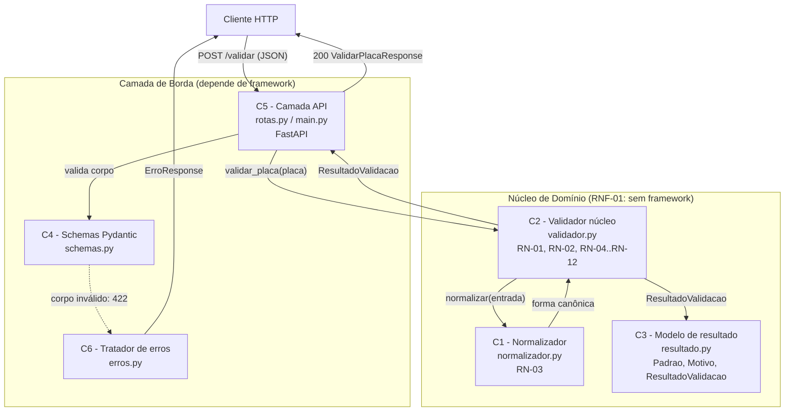
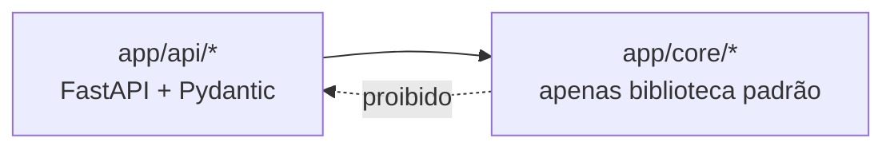

# Decomposição em Unidades — Validador de Placas Brasileiras

**Versão:** 1.0
**Data:** 2026-09-12
**Documento base:** [`spec.md`](./spec.md)

Objetivo: dividir o sistema em unidades independentes e testáveis, de modo que cada uma
possa ser implementada, revisada e testada isoladamente (desenvolvimento iterativo),
respeitando **RNF-01** (o núcleo não depende de framework web).

---

## 1. Visão Geral das Camadas

| Camada | Componente | Módulo previsto | Depende de |
|---|---|---|---|
| Domínio | C1 — Normalizador | `app/core/normalizador.py` | biblioteca padrão |
| Domínio | C2 — Validador núcleo | `app/core/validador.py` | C1, biblioteca padrão |
| Domínio | C3 — Modelo de resultado | `app/core/resultado.py` | biblioteca padrão |
| Borda | C4 — Schemas Pydantic | `app/api/schemas.py` | Pydantic, C3 (apenas valores) |
| Borda | C5 — Camada API | `app/api/rotas.py`, `app/main.py` | FastAPI, C2, C4 |
| Borda | C6 — Tratador de erros | `app/api/erros.py` | FastAPI |

**Regra de dependência (obrigatória):** as setas apontam sempre da borda para o domínio.
Nenhum módulo em `app/core/` pode importar `fastapi`, `pydantic`, `starlette` ou
`app.api.*`. Essa regra é verificável por um teste automatizado (ver §6).

---

## 2. Componentes

### C1 — Normalizador

**Responsabilidade:** transformar a entrada bruta na forma canônica definida em **RN-03**.
Não decide se a placa é válida.

**Interface:**

```python
def normalizar(entrada: str) -> str:
    """RN-03: strip -> upper -> remove um hífen separador. Retorna a forma canônica."""
```

- Entrada: `str` (o chamador já garantiu o tipo).
- Saída: `str` normalizada. Pode ter tamanho diferente de 7 — quem julga é C2.
- Sem efeitos colaterais, sem exceções esperadas.

**Testável isoladamente por:** CT-03, CT-04, CT-05, CT-08, CT-21, CT-22.

---

### C2 — Validador núcleo

**Responsabilidade:** aplicar **RN-01, RN-02 e RN-04 a RN-12** e produzir um
`ResultadoValidacao`. É o coração do sistema e o único lugar onde as regras vivem.

**Interface:**

```python
def validar_placa(entrada: object) -> ResultadoValidacao:
    """Aplica a ordem de rejeição de RN-10. Nunca lança exceção (RNF-09)."""
```

- Entrada: `object` — aceita qualquer coisa, inclusive `None` e tipos não-texto, porque
  RN-04 e RN-05 fazem parte das regras.
- Saída: `ResultadoValidacao` (C3).
- Usa C1 internamente. Não conhece HTTP, JSON, status code ou Pydantic.

**Testável isoladamente por:** CT-01 a CT-33.

---

### C3 — Modelo de resultado

**Responsabilidade:** representar o resultado da validação como dado, com vocabulário
fechado, sem depender de framework.

**Interface:** `Padrao` (Enum), `Motivo` (Enum) e `ResultadoValidacao` (dataclass imutável),
conforme §5.1 da `spec.md`.

Invariantes:

- `valida is True` implica `padrao` e `placa_normalizada` preenchidos e `motivo is None`.
- `valida is False` implica `motivo` preenchido e `padrao is None`.

**Testável isoladamente por:** testes de invariante sobre cada resultado retornado por C2.

---

### C4 — Schemas Pydantic

**Responsabilidade:** contrato de serialização da API. Valida a **forma do corpo HTTP**
(campo `placa` presente e do tipo texto) e serializa a resposta. **Não** contém regra de
negócio de placa — a decisão de validade é sempre de C2.

**Interface:**

```python
class ValidarPlacaRequest(BaseModel):
    placa: str

class ValidarPlacaResponse(BaseModel):
    valida: bool
    placa_normalizada: str | None
    padrao: str | None
    motivo: str | None
    mensagem: str

class DetalheErro(BaseModel):
    campo: str
    problema: str

class ErroResponse(BaseModel):
    erro: CorpoErro   # codigo, mensagem, detalhes: list[DetalheErro]
```

**Fronteira de responsabilidade:** falha no schema produz `422` (RF-08, CT-36 a CT-39).
Falha de regra de negócio produz `200` com `valida: false` (CT-35).

**Testável isoladamente por:** testes de (de)serialização, sem subir servidor.

---

### C5 — Camada API

**Responsabilidade:** adaptar HTTP para chamada de função e vice-versa. É uma camada fina,
sem lógica de decisão.

**Interface (endpoints):**

| Método | Rota | Entrada | Saída |
|---|---|---|---|
| `POST` | `/validar` | `ValidarPlacaRequest` | `200` `ValidarPlacaResponse` |
| `GET` | `/health` | — | `200` `{"status": "ok"}` |

Fluxo do `POST /validar`:

1. FastAPI valida o corpo com C4. Falhou, C6 devolve `422`.
2. Chama `validar_placa(request.placa)` (C2).
3. Converte o `ResultadoValidacao` em `ValidarPlacaResponse` (mapeamento 1:1 de campos).
4. Responde `200` sempre que o passo 2 executou.

**Testável isoladamente por:** CT-34 a CT-41, via `TestClient` do FastAPI.

---

### C6 — Tratador de erros

**Responsabilidade:** converter as exceções do framework no objeto de erro padronizado
de §5.4 da `spec.md` (`REQUISICAO_INVALIDA`, `METODO_NAO_PERMITIDO`, `ERRO_INTERNO`),
garantindo **RNF-09** — nenhum stack trace vaza para o cliente.

**Interface:** handlers registrados em `app/main.py` para `RequestValidationError`,
`HTTPException` e `Exception`.

---

## 3. Interfaces entre Componentes

| De | Para | Contrato |
|---|---|---|
| C5 | C4 | Corpo HTTP (JSON) para `ValidarPlacaRequest` |
| C5 | C2 | `validar_placa(placa: str) -> ResultadoValidacao` |
| C2 | C1 | `normalizar(entrada: str) -> str` |
| C2 | C3 | Constrói `ResultadoValidacao` |
| C5 | C4 | `ResultadoValidacao` para `ValidarPlacaResponse` (mapeamento de campos) |
| C6 | C5 | Intercepta exceções e devolve `ErroResponse` |

Cada seta acima é um ponto de dublê (`stub`/`fake`) possível, permitindo testar C5 com um
validador falso e testar C2 sem HTTP.

---

## 4. Diagrama



Dependência entre camadas (nunca o inverso):



---

## 5. Ordem de Implementação Sugerida

Cada passo é uma tarefa independente, testável e mergeável por PR próprio:

1. C3 — modelo de resultado (sem lógica).
2. C1 — normalizador + testes de RN-03.
3. C2 — validador núcleo + testes CT-01 a CT-33.
4. C4 — schemas + testes de serialização.
5. C5 — rotas + testes CT-34, CT-35, CT-41.
6. C6 — tratamento de erro + testes CT-36 a CT-40.

Os passos 1 a 3 não dependem de FastAPI e podem ser feitos em paralelo com o
empacotamento Docker.

---

## 6. Testabilidade

| Unidade | Tipo de teste | Dependências externas |
|---|---|---|
| C1, C2, C3 | Unitário puro (`pytest.mark.parametrize`) | nenhuma |
| C4 | Unitário de serialização | Pydantic |
| C5, C6 | Integração via `TestClient` | FastAPI |

**Teste de arquitetura (guarda de RNF-01):** um teste lê os módulos de `app/core/` e falha
se encontrar import de `fastapi`, `pydantic`, `starlette` ou `app.api`. Isso impede que a
regra de dependência seja quebrada em um PR futuro sem que alguém perceba.
